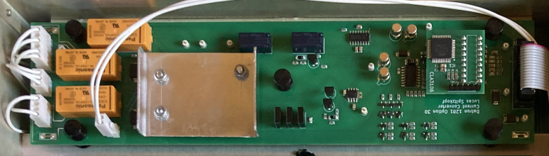
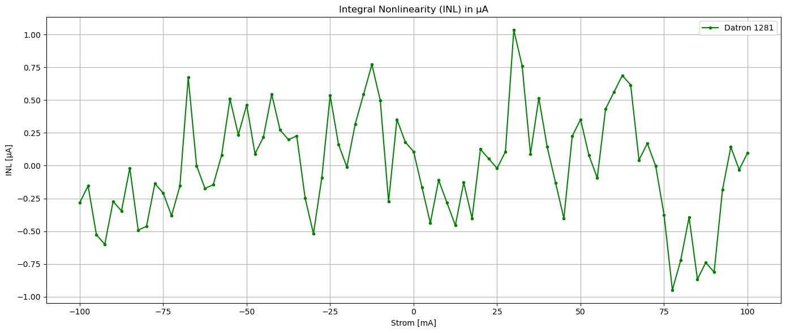

# DIY-Datron-1281-Current-Option
Add current measurement capabilities to your Datron 1281

I bought a defective Datron 1281. Sadly there was no option installed. So replicated the current measurement board as closely as I could. Most of the parts are still avaiable. The CLA3106 ASIC can be replaced with my CPLD replacement. The only problems are the JFETs for switching the low current ranges and the shunt resistors. The original JFETs were replaced with similar off-the-shelf ones. The shunt resistors are the most expensive part of this project, but there is no real other choice than Vishay foil resistors. Some resistors are custom ordered from Texas Components. The PCB features full mechanical compatibility to the original board and all guard traces.

I did some noise and linearity measurements with a DIY multifunction calibrator which uses a AD5791B and a ADR1000. The visible INL is due to the DAC INL. The noise of the 100mA range for example is 0,5µA pk2pk and 0,12µA rms. It is very possible that these measurements describe the performance of the calibrator. To know for sure, I would need a known current source.

